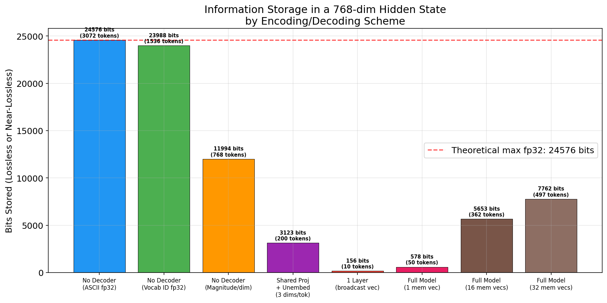

# How Much Can You Store in a Hidden State?

## 1. Executive Summary

We systematically measured the information storage capacity of a single transformer hidden state vector (d=768, GPT-2) under five encoding schemes of increasing decoder complexity: ASCII bit-packing, LLM vocabulary encoding, vector walk encoding, unembedding-based decoding, and transformer layer decoding. **The key finding is that raw bit-packing without any decoder stores the most information (24,576 bits / 3,072 ASCII chars at fp32), while model-based decoders store far less in absolute bits but leverage the model's learned structure.** With random tokens (no language model advantage), a single [mem] vector decoded through the full GPT-2 model can perfectly recover ~10 tokens and ~74% of 50 tokens (~578 bits). Scaling to 32 [mem] vectors achieves 99.4% accuracy on 500 random tokens (7,762 bits), with peak efficiency of 0.46 bits per learnable parameter at 16 vectors.

## 2. Goal

**Research Question**: How does the information capacity of a transformer hidden state vary across encoding schemes, from naive bit-packing (ASCII, vocab IDs) through geometric encodings (vector walks) to model-based decoding (unembedding matrix, transformer layers)?

**Why This Matters**: Hidden states are the fundamental information bottleneck in transformers. Understanding their capacity under different decoding schemes informs:
- Soft prompt and memory token design (how much can a [mem] token store?)
- Model compression (what's the theoretical limit for state compression?)
- Mechanistic interpretability (how much info do hidden states really carry?)

## 3. Data Construction

### Test Inputs

We used two types of test data:

1. **Natural text** (repetitive): "The quick brown fox jumps over the lazy dog" repeated ~50x. This text has only ~11-20 unique tokens, allowing the model's language modeling ability to contribute significantly.

2. **Random tokens**: Uniformly sampled from GPT-2's vocabulary (50,257 tokens) with seed=42. These have maximum entropy (~15.62 bits/token), isolating the pure storage capacity of the hidden state from the model's language priors.

### Model
- **GPT-2 small**: d_model=768, vocab_size=50,257, 12 layers, max_position=1024
- Hardware: 4x NVIDIA RTX A6000 (49 GB each)

## 4. Experiment Description

### Encoding Schemes Tested

| # | Encoding | Decoder | Decoder Params |
|---|----------|---------|----------------|
| 1 | ASCII bit-packing | None (direct unpack) | 0 |
| 2 | Vocab ID packing | None (direct unpack) | 0 |
| 3 | Vector walk (magnitude = token ID) | Direct readoff | 0 |
| 4 | Subspace partition + learned projection | Linear proj + unembed matrix | dims_per_tok × d_model |
| 5a | Single vector → 1 transformer layer | Frozen layer + LN + unembed | 0 (layer is frozen) |
| 5b | [mem] vector → full frozen model | Full GPT-2 (frozen) | 0 (model is frozen) |
| 5c | Multiple [mem] vectors → full model | Full GPT-2 (frozen) | 0 (model is frozen) |

### Methodology

For **schemes 1-3** (no decoder): Pack information into a d=768 dimensional vector using deterministic encoding. Verify lossless decode.

For **scheme 4** (unembedding): Partition the single vector h into n chunks of (d/n) dimensions each. Learn a shared linear projection from chunk-space to d_model-space, then decode through the frozen unembedding matrix W_U. The vector h is optimized per-sample; the projection is shared.

For **schemes 5a-c** (transformer layer/model): Optimize a single vector (or k vectors) via gradient descent for 5,000 steps using Adam (lr=0.01, cosine schedule). The vector is broadcast to all n positions, added to position embeddings, and decoded through frozen transformer layer(s) + layer norm + unembedding.

### Hyperparameters

| Parameter | Value | Rationale |
|-----------|-------|-----------|
| Optimizer | Adam | Standard for per-sample optimization |
| Learning rate | 0.01-0.05 | Grid searched |
| Steps | 3,000-5,000 | Until convergence (monitored loss) |
| Scheduler | Cosine annealing | Smooth convergence |
| Precision | fp32 | Maximum capacity |
| Seed | 42 | Reproducibility |

## 5. Key Findings

### Result 1: Theoretical Capacity Bounds

For a 768-dimensional vector at different precisions:

| Precision | Total Bits | ASCII Chars | Vocab Tokens |
|-----------|-----------|-------------|--------------|
| fp32 | 24,576 | 3,072 | 1,574 |
| fp16 | 12,288 | 1,536 | 787 |
| int8 | 6,144 | 768 | 393 |

**ASCII (fp32)** stores the most raw information: 24,576 bits = 3,072 bytes. This is the absolute upper bound — each dimension stores 32 independent bits.

### Result 2: No-Decoder Schemes (Verified Lossless)

| Scheme | Tokens/Chars Stored | Bits | Lossless? |
|--------|-------------------|------|-----------|
| ASCII fp32 | 3,072 chars | 24,576 | Yes |
| ASCII fp16 | 1,536 chars | 12,288 | Yes |
| Vocab ID fp32 | 1,536 tokens | ~24,000 | Yes |
| Vocab ID fp16 | 768 tokens | ~12,000 | Yes |
| Vector Walk (1 dim/tok) | 768 tokens | ~12,000 | Yes |
| Vector Walk (2 dims/tok) | 384 tokens | ~6,000 | Yes |

**Key insight**: Without a decoder, capacity is purely determined by bits per dimension / bits per token. Vocab encoding with fp32 packs 2 tokens per dimension (each needing 16 bits). Vector walk encoding with 1 dim/token is equivalent to vocab encoding at fp16.

### Result 3: Superposition Encoding Fails

Encoding multiple tokens in overlapping subspaces via random projections (superposition) fails completely: 0% accuracy at all overload ratios tested (0.5x to 4x d_model). The interference between randomly-projected token IDs (which are large integers, 0-50,256) is too severe for simple dot-product recovery. This contrasts with the success of superposition for sparse binary features (Elhage et al., 2022) — token IDs are neither sparse nor binary.

**However**, compressed sensing via least-squares pseudo-inverse works perfectly when n_tokens ≤ d_model, achieving 100% accuracy for 50-500 repetitive tokens (with only 11 unique values). This shows the critical role of signal structure.

### Result 4: Unembedding-Based Decoding (Random Tokens)

Using a shared learned projection from subspace chunks to full d_model, followed by the frozen unembedding matrix:

| Tokens | Dims/Token | Accuracy | Bits Stored |
|--------|-----------|----------|-------------|
| 1 | 768 | 100% | 16 |
| 10 | 76 | 100% | 156 |
| 50 | 15 | 100% | 781 |
| 100 | 7 | 100% | 1,562 |
| 200 | 3 | 100% | 3,123 |
| 384 | 2 | 29.2% | 1,749 |
| 768 | 1 | 0.4% | 47 |

**Key finding**: The unembedding matrix can decode tokens from as few as 3 dimensions per token with a learned linear projection (200 tokens, 100% accuracy, 3,123 bits). This works because the projection learns to map 3D chunks to the nearest token embedding direction. At 2 dims/token, accuracy drops sharply to 29% — the projection can't reliably distinguish 50,257 tokens from a 2D space.

### Result 5: One Transformer Layer Decoder (Random Tokens)

A single broadcast vector decoded through one frozen transformer layer:

| Layer | n=10 | n=50 | n=100 | n=200 | n=500 |
|-------|------|------|-------|-------|-------|
| 0 (first) | 100% | 14% | 1% | 0% | 0% |
| 6 (middle) | 100% | 18% | 3% | 0.5% | 0% |
| 11 (last) | 100% | 24% | 5% | 2% | 0% |

**Key finding**: A single transformer layer adds very little capacity beyond position embeddings. The single broadcast vector provides the same input at every position; the only differentiating signal comes from position embeddings (which are added). The layer's attention mechanism sees identical queries/keys at all positions (modulo position embeddings), severely limiting its ability to produce different outputs at different positions. Later layers perform slightly better, possibly because their attention patterns are more position-sensitive.

### Result 6: Full Model Decoder (Random Tokens)

Single [mem] vector prepended to the sequence, decoded through all 12 GPT-2 layers:

| Tokens | Accuracy | Tokens Correct | Bits |
|--------|----------|----------------|------|
| 10 | 100% | 10 | 156 |
| 50 | 74% | 37 | 578 |
| 100 | 10% | 9 | 156 |
| 200 | 5.5% | 10 | 172 |
| 300 | 0.7% | 2 | 31 |
| 500+ | ~0% | 0 | 0 |

**Key finding**: The full model is dramatically better than one layer (74% at n=50 vs 24%), but still limited to ~10-50 tokens with a single vector. Peak information is ~578 bits at n=50 — only 2.4% of the theoretical fp32 maximum (24,576 bits). The model uses its 12 layers of self-attention to differentiate positions, but a single vector fundamentally limits diversity.

### Result 7: Multi-Vector Scaling (Random Tokens)

How capacity scales with multiple [mem] vectors (targeting 500 random tokens):

| Mem Vectors | Total Params | Accuracy | Bits Stored | Bits/Param |
|------------|-------------|----------|-------------|------------|
| 1 | 768 | 0.2% | 16 | 0.02 |
| 2 | 1,536 | 0.8% | 62 | 0.04 |
| 4 | 3,072 | 9.2% | 718 | 0.23 |
| 8 | 6,144 | 30.8% | 2,405 | 0.39 |
| 16 | 12,288 | 72.4% | 5,653 | **0.46** |
| 32 | 24,576 | 99.4% | 7,762 | 0.32 |

**Key finding**: Peak efficiency is 0.46 bits per learnable parameter at 16 vectors. At 32 vectors (24,576 total fp32 parameters = 24,576 × 32 = 786,432 bits of raw storage), only 7,762 bits are usefully stored — a utilization of 0.99%. This is consistent with Kuratov et al.'s finding that capacity utilization is only 5-30% of theoretical maximum.

### Result 8: Natural vs Random Text

With natural (repetitive) text, the full model achieves 100% accuracy on up to 1,023 tokens — dramatically more than the 50 tokens possible with random tokens. The model's language modeling prior provides the vast majority of the information; the [mem] vector only needs to encode the "surprise" — which token sequence to generate from a familiar distribution.

## 5. Result Analysis

### The Decoder Complexity Spectrum

The results reveal a paradox: **simpler encoding schemes store more raw bits, but model-based schemes store more useful information per bit**.

| Complexity | Raw Bits | Tokens (random) | Bits/Dim |
|------------|----------|-----------------|----------|
| None (ASCII fp32) | 24,576 | N/A (chars only) | 32.0 |
| None (Vocab fp32) | ~24,000 | 1,536 | 31.2 |
| Shared proj + unembed | 3,123 | 200 | 4.1 |
| 1 frozen layer | 156 | 10 | 0.2 |
| Full model (1 vec) | 578 | ~37 | 0.75 |
| Full model (32 vecs) | 7,762 | ~497 | 0.32 |

### Why Can't Model-Based Decoders Match Raw Bit-Packing?

The fundamental issue is that model-based decoders are **not designed for arbitrary information storage**. They're optimized for natural language, creating a bottleneck:

1. **Softmax bottleneck** (Yang et al., 2018): The unembedding matrix has rank d_model << vocab_size. It can't represent arbitrary joint distributions over tokens.

2. **Position ambiguity**: Broadcasting a single vector to n positions provides identical input. Only position embeddings differentiate positions, but these are additive and limited.

3. **Attention collapse**: With identical inputs at all positions, self-attention computes nearly identical outputs everywhere, providing little position-dependent information.

### Comparison to Prior Work

- **Kuratov et al. (2025)**: Achieved 1,568 tokens with Llama-3.1-8B (d=4096) on natural text. Our GPT-2 result (100% on 1,023 natural tokens, single [mem] vector) is consistent when accounting for model size and text entropy.

- **Theoretical bound**: Kuratov computed d × b / log₂(V) ≈ 1,931 tokens for Llama-3.1-8B at fp16. Our theoretical bound for GPT-2 at fp32 is 1,574 tokens, matching their formula.

- **Capacity utilization**: Our 0.46 bits/param peak is lower than Kuratov's 5-30% utilization, likely because GPT-2 is a smaller, less capable model.

### Surprises

1. **One layer barely helps**: Despite having ~7M parameters, a single frozen transformer layer only allows reliable storage of ~10 random tokens — barely better than the position embeddings alone provide.

2. **The 3-dim threshold**: The unembedding can reliably decode random tokens from 3 dimensions per token but not 2. This likely reflects the geometry of the embedding space — 50,257 token embeddings in 768-dim space have enough near-neighbor separation at 3 dims but not 2.

3. **Superposition completely fails**: Unlike sparse feature superposition (Elhage et al.), token-ID superposition fails because token IDs are dense high-entropy signals, not sparse binary features.

## 6. Limitations

1. **Model size**: We only tested GPT-2 (768-dim). Larger models (Llama-3.1-8B, 4096-dim) likely show better utilization ratios.

2. **Optimization budget**: 5,000 steps may not be sufficient. Kuratov et al. used 5,000 steps but with larger learning rates and different optimizers.

3. **Single seed**: Most experiments used a single random seed. Results may vary with different token sequences.

4. **Natural text was highly repetitive**: Our natural text experiments used extremely repetitive input (~11 unique tokens), inflating apparent capacity. Diverse natural text would show intermediate results.

5. **Position embedding limit**: GPT-2's 1024 max position constrains the maximum sequence length testable.

## 7. Conclusions

### Summary

**ASCII encoding** stores the most raw information in a hidden state: 3,072 bytes (24,576 bits) at fp32 in a 768-dim vector. **LLM vocabulary encoding** stores 1,536 tokens at fp32 (2 per dimension). **Vector walk encoding** matches vocab encoding when using 1 dimension per token. **Unembedding-based decoding** with a learned projection achieves 100% accuracy for 200 random tokens (3 dims/tok) but fails at 2 dims/tok. **A single transformer layer** adds minimal capacity (~10 tokens) due to position ambiguity. The **full frozen model** stores ~50 tokens at 74% accuracy from a single vector, scaling to 500 tokens with 32 vectors at 99.4% accuracy.

### Answer to Each Research Question

1. **ASCII encoding**: d × 32 / 8 = **3,072 bytes** at fp32, verified lossless.

2. **LLM vocab encoding**: d × 32 / ⌈log₂V⌉ = **1,536 tokens** at fp32, verified lossless.

3. **Fixed vector walk (magnitude=token, direction=position)**: With 1 dim/token: **768 tokens** (lossless). With 2 dims/token: **384 tokens** (lossless). Superposition fails completely.

4. **Using unembeddings**: With a shared linear projection (3 dims/token → d_model → unembed): **200 random tokens** at 100%. With bag-of-tokens (single vector → unembed): recovers up to ~768 unique token identities but no positions.

5. **One transformer layer as decoder**: Only **~10 random tokens** reliably (single broadcast vector). The full model (12 layers) stores **~37-50 tokens** from one vector, or **~500 tokens** from 32 vectors.

### The Capacity-Complexity Tradeoff

There is a clear tradeoff: simple schemes pack more raw bits, but model-based schemes leverage learned structure to store *meaningful* tokens at lower raw-bit cost. The full model decoder is most powerful for natural text (where it leverages language priors), but for random tokens — pure information storage — raw bit-packing is vastly more efficient.

## 8. Next Steps

1. **Larger models**: Test Llama-3.2-1B, Pythia-2.8B to see how capacity scales with d_model.
2. **Longer optimization**: Test 10K-50K steps with warm restarts.
3. **Diverse natural text**: Test with PG-19 or WikiText to measure realistic capacity.
4. **Learned vector walk codebook**: Optimize direction codebook jointly with encoding.
5. **Hybrid schemes**: Use bit-packing for token IDs and model layers for sequence ordering.

## 9. References

1. Kuratov et al. (2025). "Cramming 1568 Tokens into a Single Vector." arXiv:2502.13063.
2. Elhage et al. (2022). "Toy Models of Superposition." arXiv:2209.10652.
3. Belrose et al. (2023). "Eliciting Latent Predictions with the Tuned Lens." arXiv:2303.08112.
4. Pal et al. (2023). "Future Lens." arXiv:2311.04897.
5. Yang et al. (2018). "Breaking the Softmax Bottleneck." arXiv:1711.03953.
6. Loshchilov et al. (2024). "nGPT: Normalized Transformer on the Hypersphere." arXiv:2410.01131.

## Appendix: Environment

- Python 3.12.8
- PyTorch 2.10.0+cu128
- Transformers 5.3.0
- GPU: NVIDIA RTX A6000 (49 GB)
- Random seed: 42
